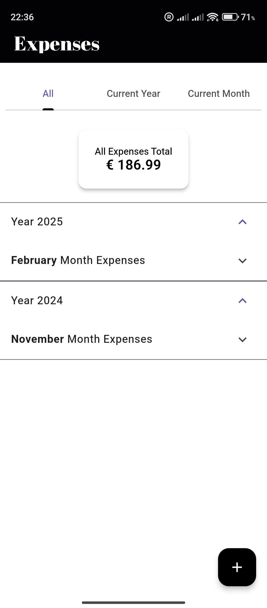
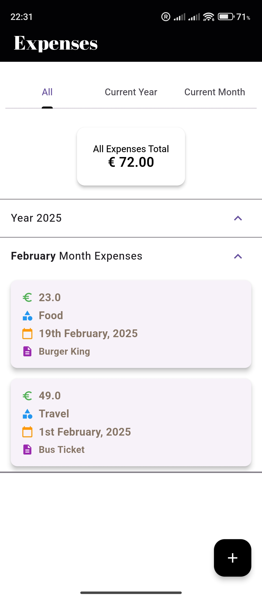
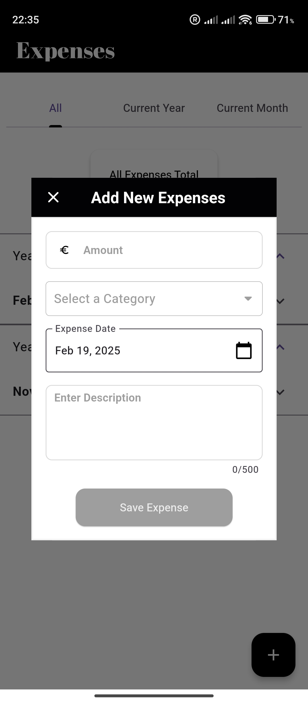
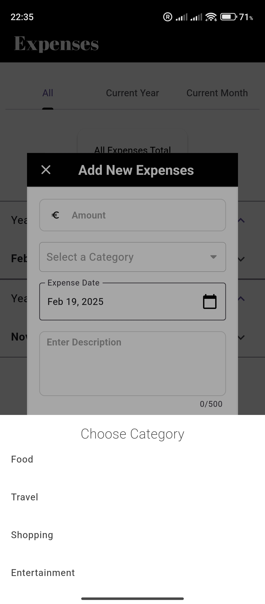

# Expense Tracker App

A **Flutter** application for tracking expenses, built with a **modular architecture** and **clean architecture principles**. This app uses **SQLite** for local storage and **dependency injection** for better maintainability.

# Expense Tracker App

<div style="display: flex; justify-content: space-between; margin: 10px;">
  <div style="flex: 1; margin: 10px;">
    
  </div>
  <div style="flex: 1; margin: 10px;">
    
  </div>
  <div style="flex: 1; margin: 10px;">
    
  </div>
  <div style="flex: 1; margin: 10px;">
    
  </div>
</div>

## Features

- **Add Expenses**: Easily add expenses with a description, amount, category, and date.
- **View Expenses**: Expenses are grouped and displayed by **day**, **month**, and **year**.
- **Update Expenses**: Modify existing expense details.
- **Summarized Reports**: Get a quick overview of total expenses for different time periods.
- **Dialog-Based UI**: Add and edit expenses through an interactive dialog.
- **State Management**: Uses `Bloc` for efficient state management.

## Project Structure

### 📂 `lib/`

#### 🏗 Infrastructure Layer
- `infrastructure/commands/` → Defines command classes for adding and retrieving expenses.
- `infrastructure/service_adapters/` → Includes `DatabaseModule` for dependency injection and `LocalDataStore` for SQLite operations.
- `infrastructure/services/local_data_store/` → Abstract `LocalDataStoreService` for database interactions.

#### 📌 Features Layer
- `features/expenses/add_expense_module/` → Handles adding expenses with request/response models and commands.
- `features/expenses/get_all_expenses/` → Implements fetching all expenses.
- `features/expenses/update_expense_module/` → Implements updating expenses.
- `features/entities/` → Contains `Expense` and `ExpenseData` models.
- `features/` → Includes `AppUseCaseEngine`, a singleton for executing synchronous and asynchronous use cases.

#### 🎨 User Interface (UI) Layer
- `src/user_interface/dashboard/` → Contains UI components, including:
  - `DashboardPage`: Main screen with tabbed navigation.
  - `AddExpenseDialog`: Dialog for adding new expenses.
  - `Expense List Components`: `DailyExpenseList`, `MonthlyExpenseList`, `YearlyExpenseList`.
  - `TotalSummaryCard`: Displays total expenses summary.
  - `Form Fields`: Category selection, amount input, date picker, and description field.

## Getting Started

### Prerequisites
- Flutter (latest stable version)
- Dart SDK

### Installation
1. Clone the repository:
   ```sh
   git clone https://github.com/AnuragKurumaddali/expense_tracker.git
   cd expense-tracker
2. Install dependencies:
   ```sh
   flutter pub get
3. Run code generation:
   ```sh
   dart run build_runner build --delete-conflicting-outputs
This command runs the code generator for dependencies and other generated files. The `--delete-conflicting-outputs` flag ensures that any conflicting files are removed before regeneration,preventing build errors.

4. Run the app:
   
   ```sh
   flutter run

## Tech Stack
- **Flutter** & **Dart**
- **SQLite** (via sqflite package)
- **Bloc** for state management
- **Dependency Injection** (injectable, get_it)
- **Clean Architecture** principles

## Test Cases

The project includes various test cases to ensure the app functions correctly, focusing on both integration and unit tests.

### Integration Tests

- **File:** `test/integration/expense_flow_test.dart`  
  **Description:** Verifies the user experience of adding an expense and ensuring that it appears in the list correctly. The test simulates entering details for an expense, saving it, and then checking if the expense description is displayed in the UI.

### Unit Tests

- **Add Expense Test**  
  **File:** `test/unit/features/expenses/add_expense_module/add_expense_test.dart`  
  **Description:** Confirms that the `AddExpense` use case correctly adds an expense to the local data store. The test ensures that the expense is saved using the `LocalDataStoreService`.

- **Get All Expenses Test**  
  **File:** `test/unit/features/expenses/get_all_expenses/get_all_expenses_test.dart`  
  **Description:** Ensures that the `GetAllExpenses` use case properly retrieves a list of expenses. The test simulates retrieving expenses from the local data store and verifies that the correct list is returned.

- **Local Data Store Test**  
  **File:** `test/unit/infrastructure/services/local_data_store_test.dart`  
  **Description:** Verifies the functionality of the local data store by checking that an expense can be saved and retrieved from the SQLite database. The test ensures that expenses are properly stored and fetched from the local database.

### Widget Tests

- **Add Expense Button Test**  
  **File:** `test/widget/dashboard/add_expense_button_test.dart`  
  **Description:** Tests the functionality of the `AddExpenseButton` widget. It checks whether the button is enabled or disabled based on the validity of the form inputs. The test ensures that the button behaves correctly when the form is valid or invalid.

## Download the APK
You can download the APK for the Expense Tracker app from the link below:

[Download the APK](release_build/app-release.apk)
